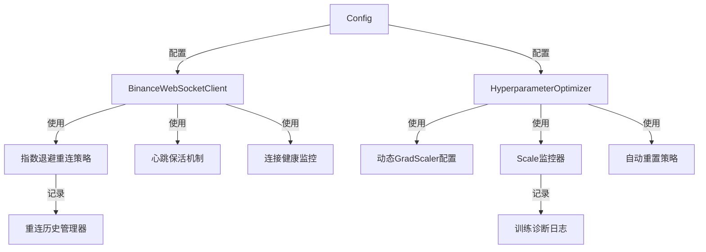
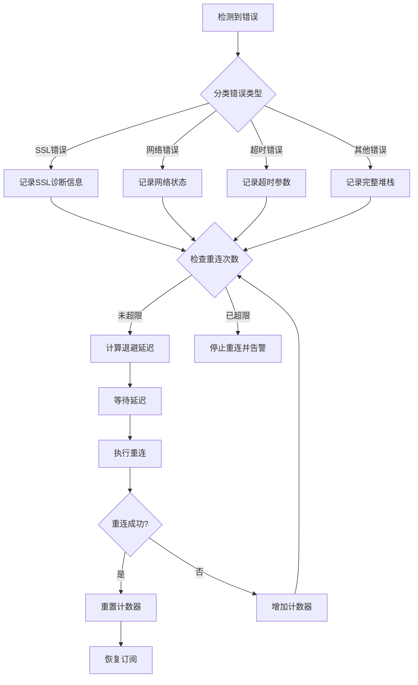

# 设计文档 - SSL连接和梯度缩放器问题修复

## 概述

本设计文档针对QuantAI-ETH交易系统中的两个关键生产问题提供详细的技术解决方案：

1. **Binance WebSocket SSL连接不稳定** - 频繁出现`DECRYPTION_FAILED_OR_BAD_RECORD_MAC`错误
2. **Informer2模型训练时GradScaler异常** - scale值增长到113246.21，远超正常范围

### 问题根因分析

#### 问题1: SSL连接错误
- **现象**: WebSocket连接频繁断开，错误信息为SSL解密失败
- **根因**: 
  - 当前重连策略过于简单，固定延迟5秒，未实现指数退避
  - 缺少心跳保活机制，长时间无数据传输导致连接被服务端关闭
  - SSL握手超时未设置，可能无限等待
  - 重连失败后缺少详细诊断信息

#### 问题2: 梯度缩放器异常
- **现象**: 训练后期scale值异常增长到113246，导致数值不稳定
- **根因**:
  - 当前growth_factor=1.5过于激进，growth_interval=1000过短
  - 初始scale值未根据模型规模动态调整
  - 缺少scale值监控和自动重置机制
  - GMADL损失函数在混合精度下数值不稳定

## 架构设计

### 组件关系图




### 系统分层架构

```
┌─────────────────────────────────────────────────────────────┐
│                    应用层 (Application)                      │
│  - TradingController                                        │
│  - SignalGenerator                                          │
└─────────────────────────────────────────────────────────────┘
                            ↓
┌─────────────────────────────────────────────────────────────┐
│                    服务层 (Services)                         │
│  - DataService (数据管理)                                    │
│  - EnsembleMLService (模型训练)                             │
└─────────────────────────────────────────────────────────────┘
                            ↓
┌──────────────────────┬──────────────────────────────────────┐
│   交易所层 (Exchange) │      模型层 (Model)                  │
│  - BinanceClient     │  - HyperparameterOptimizer          │
│  - BinanceWSClient   │  - Informer2Model                   │
│    ├─ 重连策略        │    ├─ GradScaler管理                │
│    ├─ 心跳机制        │    ├─ Scale监控                     │
│    └─ 健康检查        │    └─ 自动重置                      │
└──────────────────────┴──────────────────────────────────────┘
                            ↓
┌─────────────────────────────────────────────────────────────┐
│                    配置层 (Config)                           │
│  - settings (全局配置)                                       │
│  - 重连参数配置                                              │
│  - GradScaler参数配置                                        │
└─────────────────────────────────────────────────────────────┘
```

## 组件设计

### 1. WebSocket连接管理器增强

#### 1.1 指数退避重连策略

**类**: `ExponentialBackoffReconnector`

**职责**: 实现智能重连策略，避免频繁重连导致服务端封禁

**属性**:
```python
- initial_delay: float = 1.0  # 初始延迟1秒
- max_delay: float = 60.0     # 最大延迟60秒
- backoff_factor: float = 2.0  # 退避因子
- max_retries: int = 10        # 最大重试次数
- current_delay: float         # 当前延迟
- retry_count: int             # 当前重试次数
- reconnect_history: List[Dict]  # 重连历史记录（最近10次）
```

**方法**:
```python
async def reconnect() -> bool:
    """执行重连，返回是否成功"""
    
def calculate_next_delay() -> float:
    """计算下次重连延迟（指数退避）"""
    
def reset():
    """重置重连状态"""
    
def add_history(success: bool, error: str):
    """记录重连历史"""
    
def get_statistics() -> Dict:
    """获取重连统计信息"""
```

**算法**:
```
delay = min(initial_delay * (backoff_factor ^ retry_count), max_delay)

示例:
- 第1次: 1秒
- 第2次: 2秒
- 第3次: 4秒
- 第4次: 8秒
- 第5次: 16秒
- 第6次: 32秒
- 第7次: 60秒（达到上限）
```

#### 1.2 心跳保活机制

**类**: `WebSocketHeartbeat`

**职责**: 定期发送ping消息保持连接活跃

**属性**:
```python
- ping_interval: int = 30  # 心跳间隔30秒
- pong_timeout: int = 10   # pong超时10秒
- last_ping_time: datetime
- last_pong_time: datetime
- heartbeat_task: asyncio.Task
```

**方法**:
```python
async def start():
    """启动心跳任务"""
    
async def _heartbeat_loop():
    """心跳循环"""
    
async def send_ping():
    """发送ping消息"""
    
def on_pong_received():
    """处理pong响应"""
    
def is_alive() -> bool:
    """检查连接是否存活"""
```


#### 1.3 SSL配置优化

**修改位置**: `BinanceWebSocketClient.__init__()`

**优化内容**:
```python
# SSL上下文配置
ssl_context = ssl.create_default_context()
ssl_context.check_hostname = True
ssl_context.verify_mode = ssl.CERT_REQUIRED
ssl_context.options |= ssl.OP_NO_SSLv2 | ssl.OP_NO_SSLv3  # 禁用旧协议
ssl_context.set_ciphers('HIGH:!aNULL:!eNULL:!EXPORT:!DES:!MD5:!PSK:!RC4')

# WebSocket配置
ws_kwargs = {
    "sslopt": {
        "context": ssl_context,
        "check_hostname": True,
        "cert_reqs": ssl.CERT_REQUIRED,
        "ssl_version": ssl.PROTOCOL_TLS,  # 使用最新TLS版本
        "timeout": 30  # SSL握手超时30秒
    },
    "timeout": 30,  # 整体超时
    "ping_interval": 30,  # 启用内置ping
    "ping_timeout": 10
}
```

### 2. 梯度缩放器管理器

#### 2.1 动态GradScaler配置器

**类**: `DynamicGradScalerConfig`

**职责**: 根据模型规模和训练阶段动态调整GradScaler参数

**属性**:
```python
- model_param_count: int      # 模型参数量
- init_scale: float           # 初始缩放因子
- growth_factor: float = 1.2  # 增长因子（从1.5降低）
- backoff_factor: float = 0.5 # 回退因子
- growth_interval: int = 2000 # 增长间隔（从1000增加）
- max_scale: float = 100000   # 最大scale阈值
```

**方法**:
```python
def calculate_init_scale(param_count: int) -> float:
    """根据模型参数量计算初始scale"""
    if param_count > 10_000_000:
        return 2.**12  # 4096 (大模型)
    elif param_count > 1_000_000:
        return 2.**14  # 16384 (中等模型)
    else:
        return 2.**16  # 65536 (小模型)

def create_scaler(device: str) -> torch.amp.GradScaler:
    """创建配置好的GradScaler"""
    return torch.amp.GradScaler(
        device,
        init_scale=self.init_scale,
        growth_factor=self.growth_factor,
        backoff_factor=self.backoff_factor,
        growth_interval=self.growth_interval,
        enabled=True
    )
```

#### 2.2 Scale监控器

**类**: `GradScalerMonitor`

**职责**: 监控scale值变化，检测异常并触发自动重置

**属性**:
```python
- scaler: torch.amp.GradScaler
- scale_history: List[float]  # scale历史记录
- max_scale_threshold: float = 100000
- consecutive_overflow_count: int = 0
- max_consecutive_overflow: int = 5
- epoch_scale_records: Dict[int, float]  # 每个epoch的scale值
```

**方法**:
```python
def record_scale(epoch: int, batch: int):
    """记录当前scale值"""
    current_scale = self.scaler.get_scale()
    self.scale_history.append(current_scale)
    
    if epoch not in self.epoch_scale_records:
        self.epoch_scale_records[epoch] = current_scale
    
    # 检查是否超过阈值
    if current_scale > self.max_scale_threshold:
        logger.warning(f"⚠️ Scale值过大: {current_scale:.2f}")
        return True
    return False

def check_overflow(has_overflow: bool):
    """检查梯度溢出"""
    if has_overflow:
        self.consecutive_overflow_count += 1
        if self.consecutive_overflow_count >= self.max_consecutive_overflow:
            logger.error(f"❌ 连续{self.consecutive_overflow_count}次梯度溢出")
            return True
    else:
        self.consecutive_overflow_count = 0
    return False

def reset_scale(reset_to_percent: float = 0.5):
    """重置scale值"""
    current_scale = self.scaler.get_scale()
    new_scale = self.scaler._init_scale * reset_to_percent
    self.scaler._scale = torch.tensor(new_scale).to(self.scaler._scale.device)
    logger.warning(f"🔄 Scale已重置: {current_scale:.2f} -> {new_scale:.2f}")

def get_statistics() -> Dict:
    """获取监控统计信息"""
    return {
        'current_scale': self.scaler.get_scale(),
        'min_scale': min(self.scale_history) if self.scale_history else 0,
        'max_scale': max(self.scale_history) if self.scale_history else 0,
        'avg_scale': sum(self.scale_history) / len(self.scale_history) if self.scale_history else 0,
        'consecutive_overflow': self.consecutive_overflow_count,
        'epoch_records': self.epoch_scale_records
    }
```


### 3. 配置管理

#### 3.1 新增配置项

**文件**: `app/core/config.py`

```python
class Settings(BaseSettings):
    # ... 现有配置 ...
    
    # WebSocket重连配置
    WS_RECONNECT_INITIAL_DELAY: float = 1.0
    WS_RECONNECT_MAX_DELAY: float = 60.0
    WS_RECONNECT_BACKOFF_FACTOR: float = 2.0
    WS_RECONNECT_MAX_RETRIES: int = 10
    WS_PING_INTERVAL: int = 30
    WS_PONG_TIMEOUT: int = 10
    WS_SSL_TIMEOUT: int = 30
    
    # GradScaler配置
    GRAD_SCALER_GROWTH_FACTOR: float = 1.2
    GRAD_SCALER_GROWTH_INTERVAL: int = 2000
    GRAD_SCALER_MAX_SCALE: float = 100000.0
    GRAD_SCALER_AUTO_RESET: bool = True
    GRAD_SCALER_RESET_THRESHOLD_EPOCHS: int = 3
    GRAD_SCALER_MAX_CONSECUTIVE_OVERFLOW: int = 5
```

## 数据模型

### 重连历史记录

```python
@dataclass
class ReconnectRecord:
    timestamp: datetime
    attempt_number: int
    success: bool
    error_type: Optional[str]
    error_message: Optional[str]
    delay_seconds: float
    connection_duration_before_failure: Optional[float]  # 失败前连接持续时间
```

### Scale监控记录

```python
@dataclass
class ScaleRecord:
    epoch: int
    batch: int
    scale_value: float
    has_overflow: bool
    consecutive_overflow_count: int
    timestamp: datetime
```

## 错误处理策略

### WebSocket错误分类

```python
class WebSocketErrorType(Enum):
    SSL_ERROR = "ssl_error"              # SSL相关错误
    NETWORK_ERROR = "network_error"      # 网络错误
    TIMEOUT_ERROR = "timeout_error"      # 超时错误
    PROTOCOL_ERROR = "protocol_error"    # 协议错误
    UNKNOWN_ERROR = "unknown_error"      # 未知错误

def classify_error(error: Exception) -> WebSocketErrorType:
    """分类错误类型"""
    error_str = str(error).lower()
    
    if "ssl" in error_str or "decryption" in error_str:
        return WebSocketErrorType.SSL_ERROR
    elif "timeout" in error_str:
        return WebSocketErrorType.TIMEOUT_ERROR
    elif "connection" in error_str or "network" in error_str:
        return WebSocketErrorType.NETWORK_ERROR
    elif "protocol" in error_str:
        return WebSocketErrorType.PROTOCOL_ERROR
    else:
        return WebSocketErrorType.UNKNOWN_ERROR
```

### 错误处理流程



## 测试策略

### 单元测试

#### WebSocket重连测试
```python
class TestExponentialBackoffReconnector:
    def test_calculate_delay():
        """测试延迟计算"""
        
    def test_max_retries():
        """测试最大重试次数"""
        
    def test_reset():
        """测试重置功能"""
        
    async def test_reconnect_success():
        """测试重连成功场景"""
        
    async def test_reconnect_failure():
        """测试重连失败场景"""
```

#### GradScaler监控测试
```python
class TestGradScalerMonitor:
    def test_scale_threshold():
        """测试scale阈值检测"""
        
    def test_overflow_detection():
        """测试溢出检测"""
        
    def test_auto_reset():
        """测试自动重置"""
        
    def test_statistics():
        """测试统计信息"""
```

### 集成测试

#### WebSocket连接稳定性测试
```python
async def test_websocket_stability():
    """测试WebSocket长时间运行稳定性"""
    # 1. 启动连接
    # 2. 模拟网络中断
    # 3. 验证自动重连
    # 4. 验证订阅恢复
    # 5. 运行24小时测试
```

#### 模型训练稳定性测试
```python
def test_training_with_grad_scaler():
    """测试带GradScaler的训练稳定性"""
    # 1. 初始化模型和优化器
    # 2. 配置GradScaler监控
    # 3. 训练多个epoch
    # 4. 验证scale值在合理范围
    # 5. 验证无NaN/Inf
```


## 性能考虑

### WebSocket性能优化

1. **连接池复用**: 避免频繁创建销毁连接
2. **消息批处理**: 合并小消息减少网络开销
3. **异步处理**: 所有I/O操作使用异步模式
4. **内存管理**: 及时清理历史记录，避免内存泄漏

### 训练性能优化

1. **梯度检查点**: 使用gradient checkpointing节省50-70%内存
2. **混合精度**: 在数值稳定前提下使用AMP加速训练
3. **批次累积**: 使用梯度累积模拟大批次训练
4. **GPU内存管理**: 训练前后及时清理GPU缓存

## 监控和告警

### 关键指标

#### WebSocket监控指标
```python
metrics = {
    'connection_uptime': float,           # 连接运行时间（秒）
    'reconnect_count': int,               # 重连次数
    'reconnect_success_rate': float,      # 重连成功率
    'avg_reconnect_delay': float,         # 平均重连延迟
    'last_message_age': float,            # 最后消息距今时间
    'message_rate': float,                # 消息接收速率（条/秒）
    'error_rate': float,                  # 错误率
    'ssl_error_count': int,               # SSL错误次数
}
```

#### 训练监控指标
```python
metrics = {
    'current_scale': float,               # 当前scale值
    'scale_growth_rate': float,           # scale增长率
    'overflow_rate': float,               # 溢出率
    'consecutive_overflow': int,          # 连续溢出次数
    'scale_reset_count': int,             # scale重置次数
    'training_loss': float,               # 训练损失
    'gradient_norm': float,               # 梯度范数
}
```

### 告警规则

```python
class AlertRule:
    # WebSocket告警
    RECONNECT_FAILURE_THRESHOLD = 3       # 5分钟内重连失败3次
    MESSAGE_TIMEOUT_THRESHOLD = 1200      # 20分钟无消息
    SSL_ERROR_RATE_THRESHOLD = 0.1        # SSL错误率超过10%
    
    # 训练告警
    SCALE_THRESHOLD = 100000              # scale超过10万
    OVERFLOW_RATE_THRESHOLD = 0.2         # 溢出率超过20%
    CONSECUTIVE_OVERFLOW_THRESHOLD = 5    # 连续5次溢出
    NAN_INF_DETECTED = True               # 检测到NaN/Inf
```

## 日志规范

### 日志级别使用

```python
# DEBUG: 详细诊断信息（仅开发环境）
logger.debug(f"WebSocket收到消息: {message[:100]}")
logger.debug(f"Scale值: {scale:.2f}, 增长率: {growth_rate:.2%}")

# INFO: 正常操作信息
logger.info("✅ WebSocket连接已建立")
logger.info(f"📊 Epoch {epoch}/{total_epochs} 完成")

# WARNING: 警告但不影响运行
logger.warning(f"⚠️ Scale值较大: {scale:.2f}")
logger.warning(f"⚠️ 重连延迟增加到 {delay}秒")

# ERROR: 错误但系统可恢复
logger.error(f"❌ WebSocket连接失败: {error}")
logger.error(f"❌ 检测到梯度溢出")

# CRITICAL: 严重错误需要人工介入
logger.critical(f"🚨 已达到最大重连次数，系统停止")
logger.critical(f"🚨 训练数据包含NaN/Inf，训练终止")
```

### 日志格式

```python
# 成功操作
logger.info("✅ 操作成功: 描述")

# 警告
logger.warning("⚠️ 警告信息: 描述")

# 错误
logger.error("❌ 错误信息: 描述")

# 进度
logger.info("📊 进度信息: 描述")

# 诊断
logger.debug("🔍 诊断信息: 描述")

# 配置
logger.info("🔧 配置信息: 描述")

# 网络
logger.info("🌐 网络信息: 描述")

# 重连
logger.info("🔄 重连信息: 描述")
```

## 向后兼容性

### API兼容性

所有修改保持现有API接口不变：

```python
# BinanceWebSocketClient - 保持现有方法签名
def subscribe_kline(symbol: str, interval: str, callback: Callable)
def subscribe_ticker(symbol: str, callback: Callable)
def stop_websocket()

# HyperparameterOptimizer - 保持现有方法签名
def __init__(X, y, timeframe, model_type, use_gpu)
def objective(trial: optuna.Trial) -> float
```

### 配置兼容性

新增配置项提供默认值，旧配置文件无需修改：

```python
# 默认值与当前行为一致
WS_RECONNECT_INITIAL_DELAY: float = 5.0  # 当前值
GRAD_SCALER_GROWTH_FACTOR: float = 1.5   # 当前值（将改为1.2）
```

### 数据兼容性

模型文件格式保持不变，已训练模型可正常加载。

## 部署策略

### 灰度发布

1. **阶段1**: 仅修复WebSocket重连逻辑，观察1周
2. **阶段2**: 启用GradScaler监控（不自动重置），观察1周
3. **阶段3**: 启用自动重置功能，全量发布

### 回滚方案

```python
# 配置开关控制新功能
USE_ENHANCED_RECONNECT: bool = True
USE_GRAD_SCALER_MONITOR: bool = True
USE_AUTO_SCALE_RESET: bool = True

# 出现问题时可快速回滚
if not USE_ENHANCED_RECONNECT:
    # 使用旧的重连逻辑
    pass
```

## 文档更新

需要更新的文档：

1. **README.md**: 添加新配置项说明
2. **运维手册**: 添加监控指标和告警处理流程
3. **开发文档**: 添加WebSocket和GradScaler使用指南
4. **故障排查手册**: 添加常见问题和解决方案

## 总结

本设计通过以下关键改进解决了生产环境中的两个核心问题：

### WebSocket连接稳定性
- ✅ 指数退避重连策略（1秒→60秒）
- ✅ 心跳保活机制（30秒ping）
- ✅ SSL配置优化（30秒超时）
- ✅ 连接健康监控（20分钟超时检测）
- ✅ 详细错误诊断和历史记录

### 梯度缩放器数值稳定性
- ✅ 动态初始scale配置（根据模型规模）
- ✅ 保守增长策略（growth_factor 1.5→1.2, interval 1000→2000）
- ✅ Scale值监控和阈值告警（>100000）
- ✅ 自动重置机制（连续3个epoch或5次溢出）
- ✅ 详细训练诊断日志

所有改进遵循生产级别开发标准，确保系统稳定性、可维护性和可观测性。
